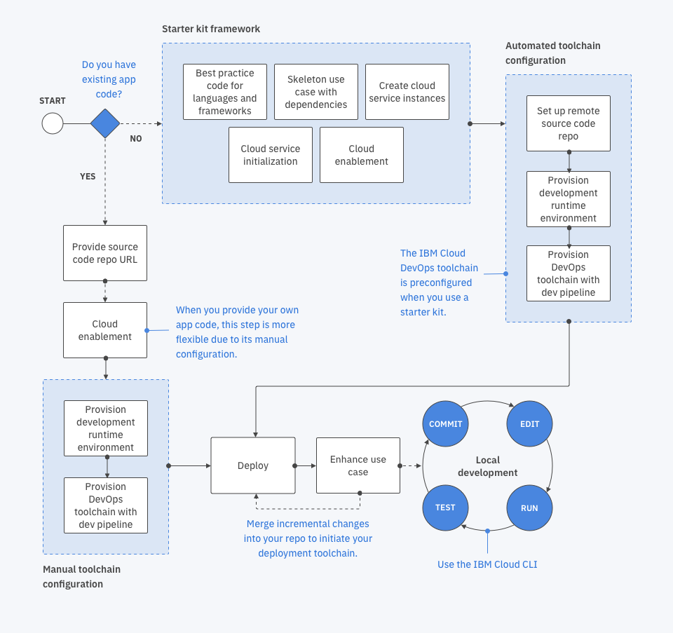

---

copyright:
  years: 2018, 2020
lastupdated: "2020-03-26"

keywords: getting started apps, create app tutorial, add services, deploy apps, create app, app tutorial

subcollection: creating-apps

---

{:shortdesc: .shortdesc}
{:new_window: target="_blank"}
{:codeblock: .codeblock}
{:pre: .pre}
{:screen: .screen}
{:tip: .tip}
{:script: data-hd-video='script'}
{:external: target="_blank" .external}

# Getting started tutorial
{: #getting-started}

You can build enterprise-ready mobile and web applications in {{site.data.keyword.cloud}} and take advantage of cloud extensions that are hosted by {{site.data.keyword.cloud_notm}}. You have several options for getting started. Create an app with a starter kit that manages the process for you, or if you know what you want, start from scratch and build your app with the resources you need, or use your existing repository and bring your own code.
{: shortdesc}

Whether you have [existing code](/docs/apps/tutorials?topic=creating-apps-tutorial-byoc) that you want to modernize and bring to the cloud, or you're developing a [brand new application](/docs/apps/tutorials?topic=creating-apps-tutorial-starterkit), you can tap into the rapidly growing ecosystem of available services and runtime frameworks in {{site.data.keyword.cloud_notm}}.

Do you need help with deciding where to start? The following diagram provides an overview for creating apps, whether you use a starter kit or bring your own code to {{site.data.keyword.cloud_notm}}.

{: caption="Figure 1. Overview of creating apps in {{site.data.keyword.cloud_notm}}" caption-side="bottom"}

## Before you begin
{: #prereqs-getting-started}

You can create your app by using the {{site.data.keyword.cloud_notm}} console or the command-line interface (CLI). If you want to use the CLI, see the [installing steps](/docs/cli?topic=cloud-cli-getting-started).

## Step 1. Create your app
{: #create-getting-started}

Create an app by selecting one of the following entry points:

* [Preconfigured starter kits](/docs/apps/tutorials?topic=creating-apps-tutorial-starterkit) are use-case-specific and give you production-ready apps in various programming languages and architectural patterns.
* [Blank starter kits](/docs/apps/tutorials?topic=creating-apps-tutorial-scratch) build apps based on your selection for type of app (mobile or backend), language and framework, services, and deployment target.
* [Bring your own code](/docs/apps/tutorials?topic=creating-apps-tutorial-byoc) by linking to your own existing content repository. Your app and Docker image must be located in the same repo.
* [{{site.data.keyword.cloud_notm}} command-line interface (CLI)](/docs/apps?topic=creating-apps-create-deploy-app-cli) creates and deploys your apps by using the {{site.data.keyword.dev_cli_short}} (`ibmcloud dev`) commands.
* Browse or search the [{{site.data.keyword.cloud_notm}} catalog](https://{DomainName}/catalog){: external} for apps and services that you can create and use today.
* [IBM Developer code patterns](https://developer.ibm.com/patterns/){: external} help you quickly create your app and deploy it to {{site.data.keyword.cloud_notm}}.

## Step 2. Add services
{: #resources-getting-started}

When you use a starter kit to create your app, the mandatory services are automatically created for you. You can connect more services to your app in the console from the App details page, which is displayed as soon as you create the app.

If you want to add services after your app is created, go to the [{{site.data.keyword.cloud_notm}} dashboard](https://{DomainName}){: external}, locate your app, and then click your app's name. The App details page is displayed, and you can create a service instance or connect existing services.

Or, you can run the following command to add a service to your app by using the CLI. You can select an existing service that is already enabled on your account, or you can add a service.
```
ibmcloud dev edit
```
{: codeblock}

For more information, see [Adding a service to your app](/docs/apps?topic=creating-apps-add-resource).

## Step 3. Deploy your app
{: #deploy-getting-started}

You can deploy your app by using the console or the CLI.

### Using the console
{: #console-getting-started}

To deploy your app by using the console, complete the following steps:

1. On the App details page, click **Deploy your app**.
2. Select a deployment target, select the toolchain settings, and click **Create**. {{site.data.keyword.cloud_notm}} automatically creates an open toolchain complete with a Git repository and continuous delivery pipeline.
3. Open the pipeline stage of your new toolchain to view the build and deployment process so that you can view your new app in minutes.

For more information, see [Deploying apps](/docs/apps?topic=creating-apps-deploying-apps).

### Using the CLI
{: #cli-getting-started}

To deploy your app by using the CLI, run the `ibmcloud dev deploy` command. For more information, see [Creating and deploying apps by using the CLI](/docs/apps?topic=creating-apps-create-deploy-app-cli).

Now you're set for iterative development and continuous delivery.

For more information, see [Deploying apps](/docs/apps?topic=creating-apps-deploying-apps).

## Related information
{: #related-getting-started}

[Programming guides](https://{DomainName}/docs/home/build){: external} are available per language to help you get up and running. You have many options for hosting your apps with {{site.data.keyword.cloud_notm}} infrastructure.
